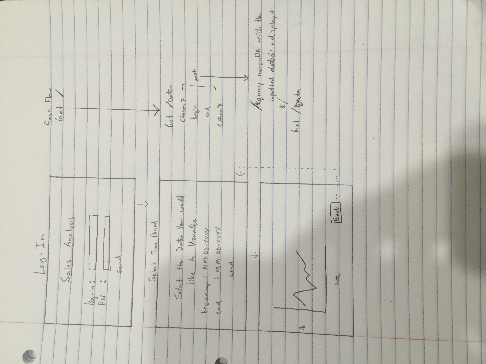

# Data Visualization and Communication


## Overview
This program will be a great way to visualize data, and potentially send this email out to your intended recipients. This is intended to be a way of improving communication and making data easier to understand. I'll use date as the independent variable so we can monitor growth.

## Data Model

I want to use mongoose.


First draft schema:

```javascript
// mock schema

var tuple = new mongoose.Schema({
id: {type:int, required: true},
date : {type:Date, required: true},
data: {type:int, required:true}
})

```

## additional modules
Mongoose- no-sql database http://d3js.org
Crossfilter.js - data manipulation library
Dc.js - library wrapper for D3.js to help with the plotting
D3.js - data visualization engine to render charts and graphs

thinking about making user-authenticated access. It may be better to make data access private or with certain degrees of authentication (simply put, only certain people can see certain stuff) .

possibly: nodemailer.js

## Wireframes



