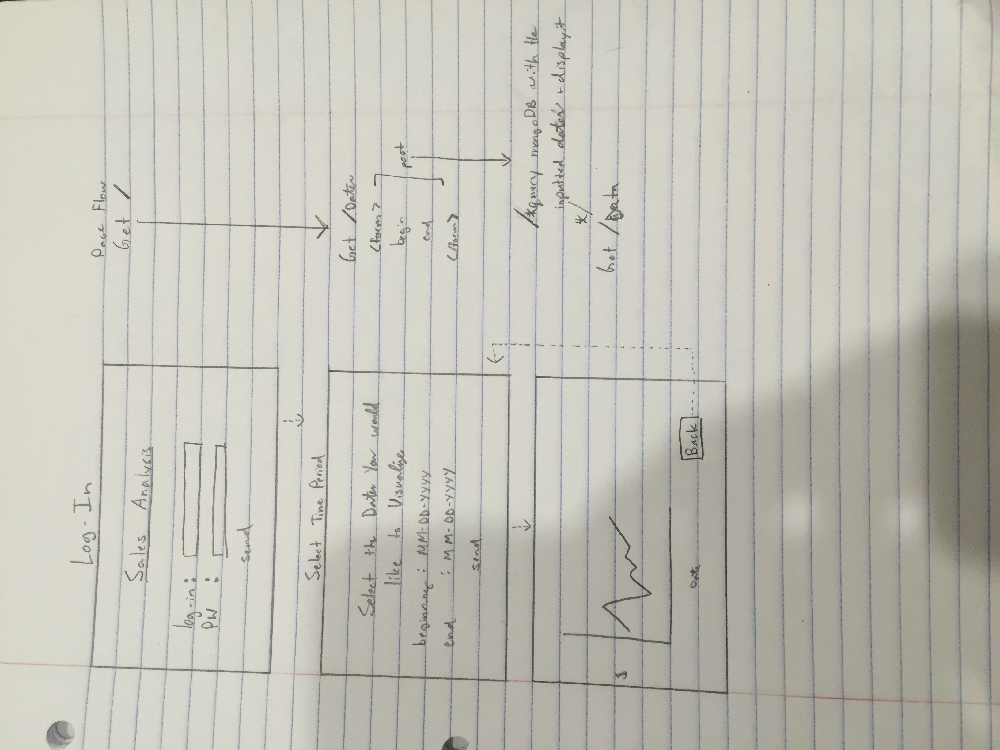

# Data Visualization and Communication


## Overview
This program will be a great way to visualize data. This is intended to help graphically monitor sales and analyze trends. I'll be storing sales transactions into a MongoDB and querying it based on inputted dates. There will be User Authentication to verify whoever is looking at the data is authorized.

NOTE: On the homepage dont forget to scroll down. On the Graph page, hover over certain points to see their corresponding value. 

## Data Model

I want to use mongoose.


First draft schema:

```javascript
// mock schema
var Transaction= new mongoose.Schema({
	Date: String,
	Close: Number,
});

```

## Research Topics and Grading Scheme 
Mongoose- no-sql database http://d3js.org
(3 Points)	User-auth
(1 Points)	D3.js - data visualization engine to render charts and graphs
(2 Points)	Dashboard/DC.js - Makes the graph interactive
(1 Point)	Responsive design
(1 Point)	Sass CSS
(1 Point)	Express project templates- Express Generator

Not sure if these count? or if I used them correctly or extensively enough?
(1 Point)	Node Sass
(1 Point)	Unit testing: Chai
(1 Point)	JSHint


## Wireframes



